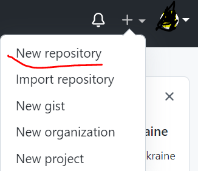

## Table of contents
- [Introduction](#Introduction)
- [Make first project](#Make-first-project)
- [Add files](#Add-files)
- [Make configuraion](#Make-configuration)
- [Make first commit](#Make-first-commit)
- [Push repository to github](#Push-repository-to-github)
- [Pull changes from remote repository](#Pull-changes-from-remote-repository)
- [Clone repository](#clone-repository)
- [Git status vs Git diff](#git-status-vs-git-diff)
- [Git log](#git-log)
- [Add changes to last commit](#add-changes-to-last-commit)
- [Git reset](#git-reset)
- [Git revert](#git-revert)
- [Git stash](#git-stash)
- [Git branch](#git-branch)
- [Git checkout](#git-checkout)
- [Git merge](#git-merge)
- [SSH protocol](#SSH-protocol)
- [Errors messages and how to solve it](#errors)
  - [Failed to push some refs](#failed-to-push-some-refs)
  - [Refusing to merge unrelated histories git pull](#refusing-to-merge-unrelated-histories)
  - [Permission denied public key](#permission-denied-public-key)
  - [Support for password authentication was removed](#support-for-password-authentication-was-removed)
  - [Another git process seems to be running in this repository](#another-git-process-seems-to-be-running-in-this-repository)
  - [merge conflicts in a Git repository](#merge-conflicts-in-a-Git-repository)

## Introduction

المحتوي اللي هيتشرح علي 🅶🅸🆃 هيكون من كتاب pro git 
[لينك الكتاب](https://link.springer.com/book/10.1007/978-1-4842-0076-6 )


بالاضافة ال 🅳🅾🅲🆄🅼🅴🅽🆃🅰🆃🅸🅾🅽 + بعض المصادر من علي موقع ``stackoverflow``
الكورس هيبقي لي أي واحد شغال في مجال ``software`` سواء


 🅲 , 🅲++ , 🅿🅷🅿 , 🅹🅰🆅🅰 ……🅴🆃🅲


  

ال git عامل زي الكاميرا اللي مثبتها قدام البيت بتراقب أي حركة في الشارع بحيث في أي وقت حصل حاجة تقدر ترجع للفيديو اللي سجلته الكاميرا في الوقت ده كذلك الأمر بالنسبة لل  git بيراقب أي ملفات أنت ضفتها أو عدلت عليها أو مسحتها وتقدر تشوف التعديل علي جزئية من الكود ال git هيوفر عليك وقت خرافي لو في مشكلة حصلت في الكود

أنا هستفيد ايه لما أتعلم ال 🅶🅸🆃 :
- هتقدر تدير ال ``🅿🆁🅾🅹🅴🅲🆃`` اللي أنت شغال عليه بكل سهولة
- هتعرف  الملفات اللي عدلت عليها بكل سهولة
- هتقدر تسترجع الملفات اللي حضرتك مسحتها بكل سهولة 
- ممكن تتراجع عن أي تعديل أنت عملته بأمر واحد فقط
- هتقدر تعمل بكل سهولة إصدارات من ال ``software`` اللي أنت شغال عليه
- أي مشكلة بتحصل تقدر تحلها بسرعة لان بيظهرلك الملفات اللي عدلت فيها فقط والجزئية اللي عدلت فيها في الملف
- لو أنت شغال في ``team`` هتقدر تعرف مين اللي كتب الكود وامتي وعدد الاسطر اللي كتابها والملفات اللي عدل عليها يعني مفيش حد هيتهم الثاني هو اللي كتب كود مش بتاعه
- كل واحد من ال ``team`` بيبقي ليه تاسك في ال ``project`` وبعد ما بينتهي منه بتعمل دمح في ال ``branch`` الرئيسية
- بمجرد ما تنتهي من ال task اللي أنت وأخدها بترفعه علي ال server سواء كان 
[Github](https://www.github.com/) أو [Gitlab](https://www.gitlab.com/)أو 
[Bitbucket](https://www.bitbucket.org/)

[رابط تحميل برنامج ال git  ](https://git-scm.com/download/win/)

## Make first project
إزاي نعمل أول``𝐩𝐫𝐨𝐣𝐞𝐜𝐭``
ك ``𝐠𝐢𝐭 𝐩𝐫𝐨𝐣𝐞𝐜𝐭`` يبقي أول أمر هتتعلمه

```bash
git init
```

الامر ``git init`` بيعمل   تهيئة للمشروع كمشروع جيت بس لازم أكون بداخل مجلد المشروع

 لو مش عامل إنشاء للفولدر هكتب اسم الفولدر بعد ``git init`` يعني الامر هيبقي بالشكل  ده


```bash
git init FolderName
```

## Add files

هبدأ اعمل انشاء لملفات المشروع وبعد ما أكتب الكود هضيف الملفات لل git وعلشان اضيف الملفات هكتب اسم الملف  اللي هضيفه علي سبيل المثال

```bash
git add index.html
```

ممكن أضيف أكثر من ملف في نفس الامر

```bash
git add index.html search.html
```

علشان أعمل حفظ للملفات في ال ``𝐠𝐢𝐭`` لازم أمر اعمل ``𝐜𝐨𝐦𝐦𝐢𝐭``  للملفات اللي ضيفتها + أني لازم أكتب رسالة معبرة عن الملفات اللي ضفتها أو عدلت عليها علي سبيل مثال ``𝐚𝐝𝐝 𝐬𝐮𝐦 𝐟𝐮𝐧𝐜𝐭𝐢𝐨𝐧`` يعني الامر في نهاية هيبقي بالشكل ده

```bash
git commit –m "Write_Your_Message"
```

## Make configuration

لما تيجي تعمل commit هيظهرلك الرسالة ده

```bash
*** Please tell me who you are.
Run
  git config --global user.email "you@example.com"
  git config --global user.name "Your Name"
to set your account's default identity.
Omit --global to set the identity only in this repository.
fatal: unable to auto-detect email address
```

معناها أنك لازم تعمل إعدادات لل git لازم تضيف الايميل واسم المستخدم اللي أنت هتستخدمهم 
وهنا هنقسم إعدادات ال 𝐠𝐢𝐭 للاعدادات عامة ``𝐠𝐥𝐨𝐛𝐚𝐥 𝐜𝐨𝐧𝐟𝐢𝐠𝐮𝐫𝐚𝐭𝐢𝐨𝐧``  وإعدادات محلية ``𝐥𝐨𝐜𝐚𝐥 𝐜𝐨𝐧𝐟𝐢𝐠𝐮𝐫𝐚𝐭𝐢𝐨𝐧`` 
ال ``global configuration`` بتطبق علي كل المشاريع اللي هتعملها بال  ``git`` 
```bash
git config --global user.email "you@example.com"

git config --global user.name "Your_UserName"
```

إمتي أستخدم ال ``local configuration`` لو أنت عايز تعمل الإعدادت علي المشروع الحالي فقط يعني مثال أنت عايز تدخل بالايميل واسم المستخدم اللي أنت شغال بيه في الشركة

```bash
git config  user.email "you@example.com"

git config  user.name "Your_UserName"
```

الاعدادات العامة بتبقي  إعدادت عامة علي كل المشاريع اللي هتعمل كمشاريع 𝐠𝐢𝐭   
والاعدادات المحلية هتبقي علي المشروع اللي أنت شغال عليه

سؤال لان عندي ``𝐠𝐥𝐨𝐛𝐚𝐥 𝐜𝐨𝐧𝐟𝐢𝐠𝐮𝐫𝐚𝐭𝐢𝐨𝐧`` ومعنديش ``𝐥𝐨𝐜𝐚𝐥`` ``𝐜𝐨𝐧𝐟𝐢𝐠𝐮𝐫𝐚𝐭𝐢𝐨𝐧`` هيبقي في الحالة ده ال  ``𝐠𝐥𝐨𝐛𝐚𝐥 𝐜𝐨𝐧𝐟𝐢𝐠𝐮𝐫𝐚𝐭𝐢𝐨𝐧`` هو اللي هيتنفد

طيب لو عندي ``global 𝐜𝐨𝐧𝐟𝐢𝐠𝐮𝐫𝐚𝐭𝐢𝐨𝐧`` وعندي ال ``𝐥𝐨𝐜𝐚𝐥 𝐜𝐨𝐧𝐟𝐢𝐠𝐮𝐫𝐚𝐭𝐢𝐨𝐧`` اللي هيتنفذ في الحالة ده ال ``𝐥𝐨𝐜𝐚𝐥 𝐜𝐨𝐧𝐟𝐢𝐠𝐮𝐫𝐚𝐭𝐢𝐨𝐧`` 

## Make first commit
علشان أعمل حفظ للملفات في ال ``𝐠𝐢𝐭`` لازم أمر اعمل ``𝐜𝐨𝐦𝐦𝐢𝐭``  للملفات اللي ضيفتها + أني لازم أكتب رسالة معبرة عن الملفات اللي ضفتها أو عدلت عليها علي سبيل مثال ``𝐚𝐝𝐝 𝐬𝐮𝐦 𝐟𝐮𝐧𝐜𝐭𝐢𝐨𝐧`` يعني الامر في نهاية هيبقي بالشكل ده
```bash
git commit –m "add sum function"
```

هنلاحظ في الامر –𝐦 وده اختصار لل 𝐦𝐞𝐬𝐬𝐚𝐠𝐞 بدلا من كتابة الكلمة بالشكل الكامل ليها –𝐦𝐞𝐬𝐬𝐚𝐠𝐞
## Push repository to github
بعد ما عملت commit للملفات أنت محتاج ترفع 𝐫𝐞𝐩𝐨𝐬𝐢𝐭𝐨𝐫𝐲 اللي المشروع بتاعك علي موقع استضافة اللي بتدعم استضافة ال repositories المواقع ده زي [github](www.github.com) و [gitlab](www.gitlab.com)  و [bitbucket](www.bitbucket.org)

 
أنت بترفع ال repository علي github ممكن تخلي ال repository خاصة أو عامة – خاصة التي اللي بتشوفها فقط – وعامة أي حد معاها الرابط ممكن يشوفها وكذلك المواقع التي تدعم استضافة مشاريع ال git

هنروح علي موقع ال github علشان ننشأ ال reposiroty من علامة ال + اللي شايفها في الصورة هتضغط عليها ومنها New Repository 



<br/>

- [Github make new repository](https://docs.github.com/en/get-started/quickstart/create-a-repo)

هيوجهك إلي صفحة تاني بعدها بتكتب ``Repository name`` وتختار المشروع ``public`` أو ``private``

ال ``public`` أي ``developer`` يقدر يشوفها

بضيف الرابط علي git 
```bash
git remote add origin url-link
```

علي سبيل المثال

```bash
git remote add origin https://github.com/userName/projectName.git
```


بعد ما عملت إضافة هبدأ أعمل ``𝐩𝐮𝐬𝐡`` ويبقي هكتب الامر ده 
```bash
git push origin master
```

بعد ما كتب  الامر السابق هتحتاج تعمل تسجيل دخول علي ال ``github``  من خلال المتصفح وهيظهرلك الصورة ده


أو ممكن تعمل تسجيل دخول علي طريق ال  ``𝙋𝙚𝙧𝙨𝙤𝙣𝙖𝙡 𝙖𝙘𝙘𝙚𝙨𝙨 𝙩𝙤𝙠𝙚𝙣`` 


 بتروح علي موقع ال ``github`` وتعمل إنشاء لل ``personal access token`` بعد ما تدخل علي موقع ال ``github``  بتروح علي 
 
``𝑺𝒆𝒕𝒕𝒊𝒏𝒈𝒔 -> 𝑫𝒆𝒗𝒆𝒍𝒐𝒑𝒆𝒓 𝑺𝒆𝒕𝒕𝒊𝒏𝒈𝒔 -> 𝑷𝒆𝒓𝒔𝒐𝒏𝒂𝒍 𝒂𝒄𝒄𝒆𝒔𝒔 𝒕𝒐𝒌𝒆𝒏``

وتعمل إنشاء ``𝑷𝒆𝒓𝒔𝒐𝒏𝒂𝒍 𝒂𝒄𝒄𝒆𝒔𝒔 𝒕𝒐𝒌𝒆𝒏`` وهتعملوا نسخ وتعمل بيه تسجيل دخول

طيب أنت هتسأل ايه هي ال ``𝐨𝐫𝐢𝐠𝐢𝐧`` ؟
هو الاسم المستعار للرابط بتاعك يعني لو أنت مش عامل إضافة للرابط كنت هتكتب الامر ده

```bash
git push https://github.com/userName/projectName.git master
```

إحنا عرفنا ``𝐨𝐫𝐢𝐠𝐢𝐧`` إيه هي ال ``𝐦𝐚𝐬𝐭𝐞𝐫`` ؟
ال ``𝐦𝐚𝐬𝐭𝐞𝐫`` هي اسم ال ``𝐛𝐫𝐚𝐧𝐜𝐡`` بتاعك يعني معني كده أنا هقدر أضيف أكتر من ``𝐛𝐫𝐚𝐧𝐜𝐡`` اه ينفع تضيف أكتر من ``𝐛𝐫𝐚𝐧𝐜𝐡``

## Clone repository

 ``git clone``  وظيفته بأخد نسخة من ال ``remote repository`` علي الجهاز زي النسخ واللصق علي الكمبيوتر أنا بنسخ المشروع الموجود علي ``github`` علي الجهاز 
```bash
git clone https://github.com/userName/projectName.git
```
وميزة ال clone هنا أني لو اتعمل أي تعديل علي ال remote repository   بقدر اسحب التعديل اللي اتعمل من خلال

```bash
git pull origin master
```

## Pull changes from remote repository

لو أنت شغال مع فريق عمل بتحتاج من وقت للتاني تسحب التعديلات اللي  حصلت علي ال remote repository 
علشان اسحب التعديلات من ال ``remote repository`` يعني شكل الامر بيبقي بالشكل اللي أنت شايفه بس مكان ال ``branchName`` بتكتب اسم ال ``branch`` اللي هتسحب منها التعديلات
```bash
git pull origin branchName
```
يعني علي سبيل المثال اسم ال ``branch`` هي ال ``master``
```bash
git pull origin master
```

## Git status vs Git diff

ال ``status``  جيه من اسمها بمعني الحالة يعني الحالة اللي عليها ال ``project`` حاليا يعني أنت ضفت ملفات جديدة عدلت علي ملفات مسحت ملفات بيجبلك كل الملفات اللي حصل عليها تغير 

```bash
git status
```
ممكن أجيب الحالة لمجلد معين وفي الحالة ده هكتب ``git status`` وإسم المجلد يعني الامر هيبقي بالشكل ده في نهاية الأمر
```bash
git status FolderName/
```
أما ال ``git diff`` فال ``diff`` اختصار لكلمة ``difference`` وهي يعني ايه اللي الاختلاف اللي حصل علي الملفات وبيجبلك الكود اللي أنت أضفته أو مسحته

```bash
git diff
```

ممكن أجيب الاختلاف اللي حصل علي ملف معين بكتب ``git diff``  وبكتب اسم الملف علي سبيل المثال

```bash
git diff index.html
```

لو أنا عايز أجيب ال ``difference`` بعد ما عملت ``add`` للملف 
```bash
git diff --cached 
```
## Git log

 إزاي تشوف كل ال ``commits`` اللي انت عملتها  
 ```bash
git log 
```
بعد ما تنفذ الامر ده بيعرضك أربع أسطر
``` bash
🅲🅾🅼🅼🅸🆃 a6cf1beaaa5c5b62aa7157872b1427cf2e5a5268
🅰🆄🆃🅷🅾🆁: Ahmed <ourprojects@yahoo.com>
🅳🅰🆃🅴:   Fri Sep 10 13:40:54 2021 +0200

     𝒄𝒐𝒎𝒎𝒊𝒕_𝒎𝒆𝒔𝒔𝒂𝒈𝒆
```
 فيهم 9 معلومات بتتعرض بعد تنفيذ **``git log``**

-	 أولا ال ``commit-id`` زي  رقم الهوية اللي لا يمكن يتكرر-  كل ``commit``   بيبقي ليه ``id`` لا يمكن يتكرر
-	تاني حاجة ``Author`` وبيقي شامل حاجتين اسم المستخدم ``username`` والايميل ``e-mail`` 
-	وثالث حاجة التاريخ اللي اتعمل فيه ال ``commit`` يعني في ال ``commit`` اللي شايفه اليوم الجمعة Fri والشهر Sep وكان يوم 10 من الشهر والوقت الساعة 13  اللي هي الساعة 1 مساء و 40 دقيقة و 54 ثانية وفي سنة 2021 
-	وأخر معلومة +0200 اللي هو فرق التوقيت  غرينتش لو عايز تعرف معلومات أكتر عن توقيت جريتنش 
[Time Zone](https://www.now-time.com/Zone/Egypt_Greenwich )


تاني حاجة لو عايز أعرض معلومات مختصرة عن ال ``commits`` 

```bash
git log –oneline
``` 

وفي الامر ده بيعرض أول 7 أرقام من ال ``commit`` + رسالة ``commit``
 
``f588d045 update_reports``


ال ``git log`` فيها معلومات كتير جدا لو عايز معلومات أكتر اكتب الامر ده 

```bash
git help log
```
وفي الامر ده بيتفتحلك المتصفح بيعرضلك كل الأوامر الخاصة بال log  الموجودة في ال ``offline documentation``   
<br/>

## Add changes to last commit

<br/>

لو أنت عايز تضيف تعديلات لأخر commit أنت عملته أولا أنت بتضيف الملف الأول 
```bash
git add index.html
```
بعد ما عملت إضافة للملف بتكتب الامر ده علشان تضيف التعديلات لاخر commit  أنت عملته
```bash
git commit –amend –no-edit
```

## Git reset

لو عايز أعمل تراجع لحد commit  معين فهنا بيجي مهمة ال reset فال reset أنا بديله ال commit-id اللي أنا عايز ال head  يقف عنده علي سبيل المثال أنا هجيب ال log الاول 
```bash
git log –-oneline
```
بعد ما أنفذ الامر السابق النتيجة هتطلع بالشكل ده

```bash
3bcbedd (HEAD -> master, origin/master, origin/HEAD) Permission denied public key
9eedf43 SSH protocol
8d80b64 Add changes to last commit
fe425ee Failed to push some refs
b341e14 git log
aa5a404 Update internal links
56c6a5c update git diff
```

لو أنا عايز أعمل تراجع لحد ال commit اللي هو ال id رقمه 8d80b64 والرسالة Add changes to last commit هيكون الأمر كالتالي
```bash
git reset 8d80b64
```
لو عايز أرجع خطوة واحدة فقط هكتب 
```bash
git reset HEAD
```

## Git revert
 
 لو عايز ترجع بمقدار خطوة بس عايز تحافظ علي ال commit اللي هتمسحه
 نفترض أنك عندك ``commits`` الموجودة  **``A,B,C,D``** أنت عايز تمسح ال ``D`` بس بعد ما تمسحه تبقي محتفظ بال ``commit``  يبقي يجي دور ال ``revert`` في الحالة ال``commits``  بدلا ما كانوا أربعة هنضيف عليهم ``commit`` تاني هيبقي خمسة 
**``A,B,C,D,E``**


```bash
git revert HEAD
```
## Git stash
لو أنا عايز أحتفظ بالتعديلات اللي أنا عملتها حفظ مؤقت لحد ما أكمل عليها وأخلي ال ``branch`` عند أخر ``commit`` تجي مهمة ``git stash``  اللي بيحفظ التعديلات حفظ مؤقت لحد ما أكمل عليها  علشان أعمل كده بكتب الأمر التالي 

```bash
git stash
```
والأمر ده زي الأمر السابق بينفذ نفس المهمة
```bash
git stash push
```
لو عايز أسترجع التعديلات علشان أكمل عليها بكتب الأمر التالي
```bash
git stash pop
```
أنا عايز أظهر ``stash`` المتاحة عندي 
```bash
git stash list
```
ممكن أعمل أكثر من ``stash`` وأطبق واحد منهم في كل مرة علي سبيل المثال لو أنا عملت تعديل في الملف أول مرة وعملت ``git stash`` وجيت عملت تعديل في ملف أو أكتر من ملف في تاني وعملت ``git stash`` فهنا بيبقي عندي ``two stash`` علشان أظهرهم بكتب الأمر السابق والنتيجة هتبقي كالتالي

```bash
stash@{0}: WIP on master: eaf408c merge conflicts in a Git repository
stash@{1}: WIP on master: eaf408c merge conflicts in a Git repository
```
علشان أنفذهم بأخد واحد منهم وأعمل ``add`` و ``commit`` وبعد كده أخد التاني
```bash
git stash apply stash@{0}
```
ده كان بالنسبة لل ``git stash``

- **[Stackoverflow make more than one stash]( https://stackoverflow.com/q/17454235/5661396)**


## Git branch

ال ``branch`` معناها الفرع زي الشجرة بالظبط فيه فرع رئيسي ومتفرع منه أكثر من فرع 

عندنا في ال ``git`` فيه ``branch`` رئيسية ممكن أعمل التعديلات فيها مباشرة لو أنت عايز تعمل ``branch`` منفصلة عن ال ``branch`` الرئيسية بحيث التعديلات تأثر فقط في ال ``branch`` الفرعية
```bash
git branch New_branch
```
 ملحوظة ال``New_branch``  ممكن تكون اي اسم أن بديلك مثال علي سبيل المثال ممكن تسميها ``dev`` أوممكن تسميها ``fixed_branch`` طيب أنا عايز أفتح ال branch اللي أنا عملتها بنفذ الأمر التالي

```bash
git checkout New_branch
```
طيب أنا ممكن أختصر الأمرين السابقين بأمر واحد فقط أعمل إنشاء لل ``branch`` وأفتح ``branch``
```bash
git checkout –b New_branch
```
لو أنا عايز أشوف كل ال branches الموجودة بكتب 
```bash
git branch
```
## Git merge

لو أنت عايز تعمل دمج  لاتنين برانش في برانش واحدة عندك برانش رئيسية ``master``  وبرانش فرعية ``dev`` 

البرانش الفرعية عملت فيها  تعديلات وبعد ما عملت ``commit`` للتعديلات عايزه تضيفها للبرانش الرئيسية 

أنت حاليا في برانش ال ``dev`` 

هتعمل ``git checkout``  لبرانش ``master``
```bash
git checkout master
```
وهتكتب ``git merge`` وبعدها اسم ال ``branch`` اللي محتاج تعملها ``merge``
```bash
git merge dev
```
لو أنت عملت دمج  وعايز تتراجع عن الدمج بتكتب الامر التالي
```bash
git reset –merge ORIG_HEAD
```
- **[Stackoverflow undo merge]( https://stackoverflow.com/a/2389423/5661396)**


## Git checkout

الأمر ليه ليه استخدامات عديدة يعني أنا ممكن أستخدمه علشان أجيب الملفات اللي عدلت عليها أو الملفات اللي مسحتها بالأمر التالي
```bash
git checkout
```
ممكن استخدمه علشان اتراجع عن التعديلات اللي عملتها في الملفات أو الملفات اللي مسحتها بس بشرط الملفات مكنش عملتها ``commit``
```bash
git checkout .
```
لو عايز أتراجع عن ملف بعينه
```bash
git checkout filename
```
لو عايز أشوف ال ``branch`` عند مرحلة معينة أو عند ``commit`` معين بكتب ``commit_id`` بعد ``git checkout`` علي سبيل المثال 
```bash
git checkout eaf408c
```
عايز أرجع لل ``branch`` 

```bash
git checkout branchName
```

لو عايز أشوف ``branch`` عند ``tag`` معين
```bash
git checkout tagName
```

لو أنت عايز أجيب ملف من ``branch`` تاني بكتب اسم ال ``branch`` اللي عايز اسحب منها الملف واسم الملف اللي عايز اجيبه 
```bash
git checkout branchName –- filename
```
لو الملف ده بداخل مجلد يبقي هتكتب اسم المجلد بعدها / وبعدها اسم الملف **``FolderName/FileName``**
 
```bash
git checkout branchName –- folderName/filename
```

## SSH protocol
**[لينك الفيديو](https://youtu.be/D9UZINTdvXU)** 

هو بروتوكول برسل  بيه وأستقبل بيه بيانات مشفرة البيانات اللي برسلها بيتفك تشفيرها  بال public key والبيانات اللي بستقبلها بيتفك تشفيرها بال ``private key`` 
إزاي أعمل إنشاء لل ``public key``  وال ``private key``

```bash
ssh-keygen
```
ال keygen اختصار ل key generation  وهو إنشاء ال key بعد ما تكتب الأمر السابق ودوس ``Enter`` هيطلب منك اسم الملف احنا مش هنغير اسم الملف هنخلي الاسم الافتراضي بتاعه اللي هو ``id_rsa`` وبالتالي هدوس  ``Enter`` هيطلب منك تدخل الباسورد ممكن تدخل باسورد أو تسيب الباسورد فاضي وهدوس ``Enter``  وبكده هو عملك ``public key`` و ``private key``  
هتاخد المحتوي اللي بداخل ال ``public key``  وتحطه علي ال ``server`` طيب أنا بعمل نسخ للمحتوي اللي بداخل ``public key`` إزاي من خلال الامر ده

```bash
cat id_rsa.pub |clip
```
ممكن ال server يكون github أو gitlab أو bitbucket علي حسب ما أنت شغال احنا هنا هنحط ال github بتفتح موقع ال github ومن ال

``Settings -> SSH and GPG KEYS -> New SSH key``

وهتضيف ال public key بعد ما ضفته بعمل اختبار ssh-key  بالأمر التالي
```bash
ssh –T git@github.com
```
المفروض بعد ما تكتب الأمر هيظهرلك الرسالة ده 
```bash
Hi UserName! You've successfully authenticated, but GitHub does not provide shell access.
```
وبكده أنت عملت اتصال لل github بنجاح عن طريق ال public key  وال private key بنجاح

## Errors

<br/>

### *Failed to push some refs*

<br/>

نص الرسالة بيبقي بالشكل ده

<br/>

```bash
 ! [rejected]        master -> master (non-fast-forward)
error: failed to push some refs to 'https://github.com/farghly/learn-git.git'
hint: Updates were rejected because the tip of your current branch is behind
hint: its remote counterpart. Integrate the remote changes (e.g.
hint: 'git pull ...') before pushing again.
hint: See the 'Note about fast-forwards' in 'git push --help' for details.
```
المشكلة ده بتحصل ليه 

-	أولا لو أنت شغال مع فريق عمل يبقي أكيد في تعديلات أترفع لل repository فالمفروض  تسحب التعديلات أولا 

```bash
Git pull origin master
```
بعد ما سحبت التعديلات أعمل push

```bash
git push origin master
```


-	ثانيا أنت ممكن تكون غيرت الرسالة لل commit 

```bash
git commit --amend -m "Your_message" 
```
فلازم وأنت بتعمل push لو أنت شغال مع فريق عمل لازم تعمل  ``pull`` وتعمل  ``push``لو أنت بس اللي شغال علي المشروع هتكتفي بالأمر الثاني

```bash
git pull origin master
```
```bash
git push --force origin master
```

-	ثالثا أنت ممكن عملت إضافة لملف وضفته لاخر ``commit message`` يعني ال ``commit`` بالشكل ده

<br/>

```bash
git commit –-amend –-no-edit
```
فلازم وأنت بتعمل push  تعمل إعادة كتابة علي commits يعني الأمر هيبقي بالشكل ده
```bash
git push --force origin master
```

## Refusing to merge unrelated histories

- [Stackoverflow problem link](https://stackoverflow.com/q/37937984/5661396)

المشكلة ده بتحصل لما يبقي عندك ``repository`` علي الكمبيوتر وعملت ``repository`` علي ال ``github`` وفي ال ``repository`` اللي علي ``github`` عملت إنشاء لملف أو أضفت ملف ال ``readme`` فهنا بيحصل تعارض وأنت بتعمل ``push`` ل ``repository`` علشان نحل المشكلة ده بعمل pull الأول  أو ممكن المشكلة تحصل وأنت بتعمل ``rebase``

```bash
git pull origin master --allow-unrelated-histories
```
وبعد الأمر السابق بعمل push 
```bash
git push origin master 
```

## Permission denied public key


**[لينك الفيديو](https://youtu.be/D9UZINTdvXU)**

الخطأ بيحصل لما تعمل إعادة إنشاء لل private key فبيحصل تعارض بين public key الموجود علي ال Github وال private key  فالحل إحنا نأخذ ال public key ونحطه علي ال server 

أو ممكن الخطأ يظهر لما نسمي الملف اسم غير الاسم الافتراضي ففي الحالة ده هننشأ ملف ونسميه config هتفتح ال git bash في مجلد .ssh وهتكتب الأمر التالي 
```bash
 touch config
```
وهتفتح ملف config وهتكتب فيه 
```bash
identityfile ~/.ssh/githubkey
```
وهتعمل حفظ وتقفل الملف وتعمل اتصال 
```bash
ssh –T git@github.com
```

## Support for password authentication was removed

لما تيجي تسجل دخول لل github من علي ال git بيظهر الرسالة ده
```bash
remote: Support for password authentication was removed on August 13,2021
please use a personal access token instead.
remote:please see https://github.blog/2020-12-15-token-authentication-requirements-for-git-operations/
fatal unable to access 'https://github.com/user/repo.git':
The request URL returned error:403
```
لأن ال ``github`` بيدعم أنك تسجل دخول ``personal access token`` وده تحل محل كلمة السر  علشان تعمل ال ``personal access token`` بتدخل علي موقع ال ``github`` ومن

``𝑺𝒆𝒕𝒕𝒊𝒏𝒈𝒔 -> 𝑫𝒆𝒗𝒆𝒍𝒐𝒑𝒆𝒓 𝑺𝒆𝒕𝒕𝒊𝒏𝒈𝒔 -> 𝑷𝒆𝒓𝒔𝒐𝒏𝒂𝒍 𝒂𝒄𝒄𝒆𝒔𝒔 𝒕𝒐𝒌𝒆𝒏``

وتعمل إنشاء ``Generate new token`` وبعد ما تعملها إنشاء بتعملها نسخ وتحطها في شاشة تسجيل الدخول ال ``git`` 

## Another git process seems to be running in this repository

المشكلة ده بتحصل لما تبقي بتنفذ أمر معين في ال ``git`` وأنت عايز تنفذ أمر تاني في نفس الوقت أو الأمر يكون شغال في الخلفية ولسه مخلص فحل المشكلة ده أنت بتمسح ``index.lock`` الموجود بداخل مجلد ``.git``
  ```bash
rm -f .git/index.lock
```

## merge conflicts in a Git repository

المشكلة ده بتحصل لما تعمل دمج لاثنين branch علي سبيل المثال أنت عايز تعمل دمج ل branch ال master و branch ال develop حل المشكلة ده أنت تحل ال conflict بين الملفات شوف الرابط ده

-	[merge conflicts in a Git repository]( https://stackoverflow.com/q/161813/5661396)


